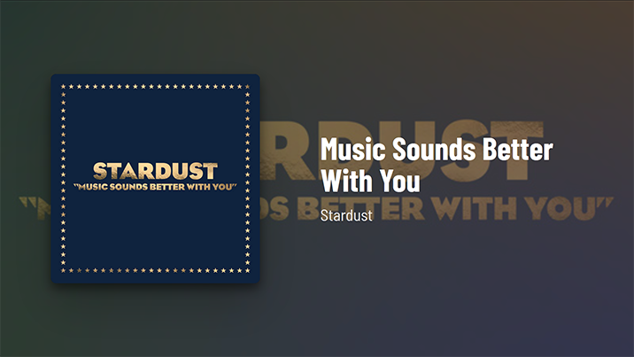

# Currently Playing Display

Watch the app demo here: [https://www.youtube.com/watch?v=Sniz7l2zR9E](https://www.youtube.com/watch?v=Sniz7l2zR9E)

## Installation

- Copy `.env.sample` to `.env`
- Create a Spotify app at [developer.spotify.com](https://developer.spotify.com/documentation/web-api/concepts/apps)
- Under Redirect URIs, add `http://localhost:8080/spotify/callback`
- Update `.env` with your app's client ID, client secret, and redirect URI
- Run `npm run build && npm run serve`
- Open [http://localhost:8080](http://localhost:8080) in your browser